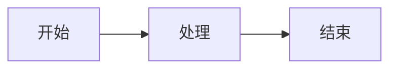
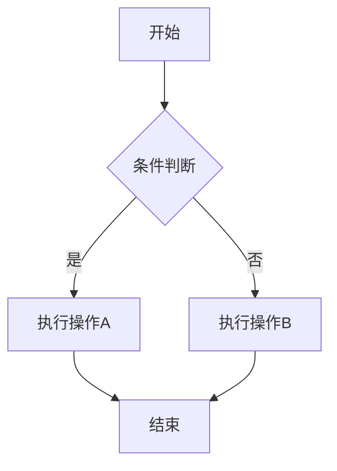

# Mermaid Viewer 使用指南

> 本文档介绍如何使用 Mermaid Viewer 本地工具来展示 Mermaid 图表和 Markdown 文档。

## 目录

1. [简介](#简介)
2. [功能特性](#功能特性)
3. [快速开始](#快速开始)
4. [使用示例](#使用示例)
5. [快捷键](#快捷键)
6. [常见问题](#常见问题)

---

<h2 id="简介">简介</h2>

**Mermaid Viewer** 是一个完全本地化的图表展示工具，支持：

- 🎨 **Mermaid 图表渲染** - 流程图、时序图、类图等
- 📝 **Markdown 文档展示** - 完整支持 GFM 语法
- 📋 **JSON 数据预览** - 支持 JSON 格式化与交互式折叠
- 📂 **文件夹浏览** - 快速浏览和切换目录下的文件
- 🌙 **暗黑/亮色主题** - 支持双主题切换，自动检测系统偏好
- 💾 **历史记录与收藏** - 自动保存历史，支持收藏常用图表
- 📤 **多格式导出** - 支持 SVG/PNG 图片及 Markdown/JSON/HTML 文件导出
- 📋 **复制到剪贴板** - 一键复制图片到系统剪贴板
- 🖱️ **拖拽平移** - 支持鼠标拖拽查看大图表
- 👆 **触摸支持** - 支持触摸屏的单指拖拽和双指缩放
- 📺 **全屏预览** - 专注查看渲染结果

<h2 id="功能特性">功能特性</h2>

### 支持的图表类型

| 图表类型 | 关键字                | 说明           |
| -------- | --------------------- | -------------- |
| 流程图   | `graph` / `flowchart` | 展示流程和决策 |
| 时序图   | `sequenceDiagram`     | 展示对象间交互 |
| 类图     | `classDiagram`        | 展示类结构关系 |
| 状态图   | `stateDiagram`        | 展示状态转换   |
| ER图     | `erDiagram`           | 展示实体关系   |
| 甘特图   | `gantt`               | 展示项目进度   |
| 饼图     | `pie`                 | 展示数据占比   |

### 支持的文件格式

- **.mmd / .mermaid**: Mermaid 图表文件
- **.md / .markdown**: Markdown 文档
- **.json**: JSON 数据文件（支持格式化和折叠预览）
- **.txt**: 纯文本文件

### 智能识别

工具会**自动识别**输入内容的类型：

- 如果内容以 Mermaid 关键字开头，自动按图表渲染
- 如果内容包含 Markdown 语法特征，自动按文档渲染
- 如果是 JSON 格式，自动格式化并提供交互式预览
- 也可以手动切换模式（点击工具栏的 "Mermaid"、"Markdown" 或 "自动" 按钮）

### 文件管理

点击左侧输入框上方的按钮：

- **打开文件夹**：浏览并快速切换同一目录下的文件
- **上传文件**：加载本地文件内容
- **文件夹导航**：在输入框右上角显示当前文件夹内容，支持点击切换文件

### 内置示例

点击工具栏的 **"示例"** 按钮，可以快速加载各种图表示例：

- 流程图示例
- 时序图示例
- 类图示例
- 状态图示例
- ER图示例
- 甘特图示例
- 饼图示例
- 使用指南（本文档）

### 主题切换

- 点击工具栏的 **太阳/月亮图标** 可以切换暗黑/亮色主题
- 主题设置会自动保存，下次访问时保持
- 首次访问时会自动检测系统主题偏好
- 图表颜色会随主题自动调整

### 导出与分享

| 功能     | 操作            | 说明                  |
| -------- | --------------- | --------------------- |
| 导出 SVG | 点击 "SVG" 按钮 | 矢量格式，可无限缩放  |
| 导出 PNG | 点击 "PNG" 按钮 | 高清位图（2倍分辨率） |
| 文件导出 | 点击 "导出" 菜单 | 支持导出 .md / .json / HTML |
| 复制图片 | 点击复制按钮    | 复制 PNG 到系统剪贴板 |

### 视图控制

| 功能     | 操作                      |
| -------- | ------------------------- |
| 缩放     | 点击 +/- 按钮或使用快捷键 |
| 拖拽平移 | 鼠标左键拖动预览区        |
| 全屏预览 | 点击全屏按钮或按 F 键     |
| 触摸缩放 | 双指捏合/张开（触摸屏）   |
| 触摸拖拽 | 单指滑动（触摸屏）        |

<h2 id="快速开始">快速开始</h2>

### 1. 启动服务

```bash
cd mermaid-viewer
python server.py
```

服务启动后会自动打开浏览器。

### 2. 访问应用

如果浏览器没有自动打开，手动访问：

```
http://localhost:8080
```

### 3. 开始使用

- **直接输入**：在左侧编辑区输入内容
- **打开文件夹**：点击"打开文件夹"浏览项目目录
- **上传文件**：点击"上传文件"按钮选择支持的文件
- **拖拽上传**：将文件拖拽到编辑区
- **加载示例**：点击"示例"下拉菜单选择内置示例

<h2 id="使用示例">使用示例</h2>

### 简单流程图



### 带分支的流程图



### 代码示例

下面是一段 JavaScript 代码：

```javascript
// 初始化 Mermaid
mermaid.initialize({
    startOnLoad: true,
    theme: 'dark'
});

// 渲染图表
async function renderDiagram(code) {
    const { svg } = await mermaid.render('diagram', code);
    document.getElementById('output').innerHTML = svg;
}
```

### 列表示例

**无序列表：**

- 功能一：实时预览
- 功能二：智能识别
- 功能三：历史记录
  - 自动保存
  - 最多保存 20 条
- 功能四：主题切换
  - 暗黑模式
  - 亮色模式

**有序列表：**

1. 打开应用
2. 输入内容或加载示例
3. 查看预览
4. 调整视图（缩放、拖拽）
5. 导出或复制图片

### 引用

> "简单是终极的复杂。"
> 
> — 列奥纳多·达·芬奇

### 任务列表

- [x] 支持 Mermaid 图表渲染
- [x] 支持 Markdown 文档展示
- [x] 支持 JSON 格式化与预览
- [x] 支持文件夹浏览与导航
- [x] 支持暗黑/亮色主题切换
- [x] 支持导出 SVG/PNG/MD/HTML/JSON
- [x] 支持复制图片到剪贴板
- [x] 支持拖拽平移
- [x] 支持触摸交互
- [x] 支持全屏预览

<h2 id="快捷键">快捷键</h2>

| 快捷键             | 功能              |
| ------------------ | ----------------- |
| `Ctrl + S`         | 保存到历史记录    |
| `Ctrl + E`         | 导出 SVG          |
| `Ctrl + Shift + E` | 导出 PNG          |
| `Ctrl + H`         | 切换历史面板      |
| `F`                | 切换全屏预览      |
| `?`                | 显示帮助面板      |
| `Escape`           | 关闭面板/退出全屏 |

> 💡 **提示**：按 `?` 键可以随时查看快捷键帮助。

<h2 id="常见问题">常见问题</h2>

### Q: 如何退出全屏预览？

按 `Escape` 键或再次按 `F` 键即可退出全屏模式。

### Q: 图表太大看不全怎么办？

1. 使用鼠标拖拽平移查看
2. 使用缩放按钮调整大小
3. 触摸屏可用双指缩放

### Q: 如何保存我的图表？

1. **保存到历史**：按 `Ctrl + S` 保存到本地历史记录
2. **导出文件**：点击 SVG 或 PNG 按钮导出图片
3. **复制粘贴**：点击复制按钮，然后粘贴到其他应用

### Q: 主题设置会保存吗？

是的，主题设置会保存在浏览器本地存储中，下次访问时会自动恢复。

---

## 结语

希望这个工具能帮助你更好地展示和分享你的图表与文档！

如有问题或建议，欢迎反馈。

**祝使用愉快！** ✨
